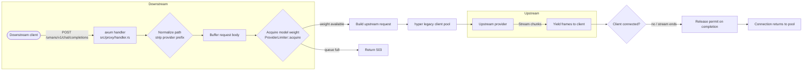

# umans-gate


> Provider-agnostic OpenAI-compatible weighted concurrency gateway proxy

## TL;DR

umans-gate is a provider-agnostic OpenAI-compatible weighted concurrency gateway proxy written in Rust. It sits between your client and any upstream AI endpoint, enforces weighted per-provider concurrency limits, forwards the original `Authorization` header unchanged, streams responses with backpressure, and serves a live dashboard on a second port. Run it with zero configuration and it auto-fetches provider models so you can start immediately.

## Why?

Most client-side throttling is guesswork. umans-gate turns provider capacity into a strict, observable budget. For the reasoning behind each design choice, see [docs/decisions/](docs/decisions/).

## Features

- Path-based proxy routing for `/{provider.id}/*`, where every provider in `config.yaml` becomes its own route prefix.
- Weighted per-provider concurrency limits backed by a fixed-point semaphore engine.
- Zero-race accounting using milliunit weights inside `tokio::sync::Semaphore`.
- Streaming response passthrough with backpressure and no buffering.
- Live dashboard with HTMX polling, updated every second.
- YAML configuration with file-watch hot-reload.
- Self-updating CLI with shell completion generation.
- Pure Rust TLS backend via rustls.

## Quick Start

No config file is required.

```bash
umans-gate
```

The gateway will:

1. Listen on `0.0.0.0:8080` for proxy traffic.
2. Serve the dashboard on `127.0.0.1:9090`.
3. Fetch the default model list from `https://api.code.umans.ai/v1/models/info` and build a working configuration automatically.

Then point your client at `http://localhost:8080/{provider.id}` (for example, `/umans/v1/chat/completions`) and open `http://localhost:9090` for the dashboard.

## Installation

### Shell (curl)

```bash
curl -fsSL https://raw.githubusercontent.com/codegiveness/umans-gate/main/install.sh | sh
```

### PowerShell

```powershell
irm https://raw.githubusercontent.com/codegiveness/umans-gate/main/install.ps1 | iex
```

### Cargo

```bash
cargo install umans-gate
```

Or build from a local checkout:

```bash
cargo install --path crates/umans-gate-cli
```

In all cases the installed binary name is `umans-gate`.

## Configuration

umans-gate discovers configuration in this order:

1. `--config <path>` if you pass one.
2. `config.yaml` in the current working directory.
3. `~/.config/umans-gate/config.yaml` (XDG config directory).
4. If none of the above exist, it fetches a default model list from `https://api.code.umans.ai/v1/models/info` and creates a running configuration with all models at weight `1.0` and provider capacity `4.0`.

You can override the auto-fetch URL with the `models_info_url` config field or the `UMANS_GATE_MODELS_INFO_URL` environment variable.

### Example `config.yaml`

```yaml
bind: "0.0.0.0:8080"
dashboard:
  bind: "127.0.0.1:9090"
  history:
    max: 1000
  kill_button:
    min_age_seconds: 300
providers:
  - id: umans
    upstream_url: "https://api.code.umans.ai"
    capacity: 4.0
    timeouts:
      connect: null
      ttfb: null
      stream_idle: null
      total: null
      queuetimeout: { secs: 300, nanos: 0 }
      maxqueue: 64
      permit_cooldown: { secs: 1, nanos: 0 }
    models:
      - id: umans-coder
        weight: 1.0
      - id: umans-flash
        weight: 0.5
      - id: umans-kimi-k2.7
        weight: 1.0
      - id: umans-glm-5.2
        weight: 1.0
      - id: umans-qwen3.6-35b-a3b
        weight: 0.5
      - id: umans-glm-5.2-nvfp4
        weight: 1.0
```

### Field reference

| Field | Type | Default | Description |
|---|---|---|---|
| `bind` | string | `0.0.0.0:8080` | Address and port for the proxy server. |
| `dashboard.bind` | string | `127.0.0.1:9090` | Address and port for the live dashboard. |
| `dashboard.history.max`<br>`--history-max` | integer | `1000` | Completed requests kept in dashboard history. `0` means unlimited. `--history-max` overrides the config value. |
| `dashboard.kill_button.min_age_seconds`<br>`--kill-min-age-seconds` | integer | `300` | Minimum age in seconds before the kill button appears. `--kill-min-age-seconds` overrides the config value. |
| `models_info_url` | string | `https://api.code.umans.ai/v1/models/info` | URL used for auto-config when no config file is found. |
| `providers` | list | required | List of upstream AI providers. |
| `providers[].id` | string | required | Provider identifier; used for routing. |
| `providers[].upstream_url` | string | required | Base URL of the upstream API. |
| `providers[].capacity` | float | required | Maximum concurrent weight the provider can hold. |
| `providers[].models` | list | required | Models that belong to this provider. |
| `providers[].models[].id` | string | required | Model identifier. |
| `providers[].models[].weight` | float | required | Concurrency weight charged while a request is active. |
| `providers[].timeouts.connect` | duration or `null` | `null` (infinity) | TCP connect timeout; `null` disables the limit. |
| `providers[].timeouts.ttfb` | duration or `null` | `null` (infinity) | Time to first byte timeout; `null` disables the limit. |
| `providers[].timeouts.stream_idle` | duration or `null` | `300s` | Idle timeout between stream chunks; `null` disables the limit. |
| `providers[].timeouts.total` | duration or `null` | `null` (infinity) | Hard total timeout per request; `null` disables the limit. |
| `providers[].timeouts.queuetimeout` | duration | `30s` | Maximum time a request may wait in the provider queue before being rejected. |
| `providers[].timeouts.maxqueue` | integer | `64` | Maximum number of requests that may wait in the provider queue. |
| `providers[].timeouts.permit_cooldown` | duration | `500ms` | Cooldown between attempts to acquire a permit from the queue. |

Model weights must be greater than zero and may not exceed the provider capacity. The loader rejects invalid configs and refuses to start.

## Usage

Run the gateway with a config file:

```bash
umans-gate serve --config config.yaml
```

Run in the foreground with zero config:

```bash
umans-gate
```

Config file watching is enabled by default and hot-reloads limits on changes. Use `--no-watch` to disable it:

```bash
umans-gate serve --config config.yaml --no-watch
```

Check for a newer release without installing:

```bash
umans-gate update --dry-run
```

Install the latest release:

```bash
umans-gate update
```

Remove the binary:

```bash
umans-gate uninstall --yes
```

Generate shell completions:

```bash
umans-gate completions bash
umans-gate completions zsh
umans-gate completions fish
umans-gate completions powershell
```

## Routing

The gateway routes by the first path segment. Every provider declared in `config.yaml` exposes its own prefix:

| Prefix | Upstream |
|---|---|
| `/{provider.id}/*` | `providers[].id == {provider.id}` |

With the `umans` provider from `config.yaml`:

- `POST /umans/v1/chat/completions` is forwarded to the `umans` provider as `/v1/chat/completions`.
- `GET /umans/models` is normalized to `/v1/models` and forwarded; `/umans/v1/models` is forwarded as-is without a double `/v1/`.

The provider prefix is stripped and the remaining path is normalized before forwarding. Paths that already contain `v1/` are not double-prefixed, and paths that omit it have `v1/` added automatically. Requests without a recognized provider prefix, such as `/v1/chat/completions`, return `404`.

The `/health` endpoint on the proxy port remains unchanged and returns `ok`.

## Dashboard

The dashboard is served on `dashboard.bind` and refreshes with HTMX polling (`hx-trigger="every 1s"`). It renders the current consumed weight, capacity bar, and active model list for every configured provider. The request list also shows each request's enqueued-at time and its client/upstream protocol version.

**Security warning:** the dashboard has **no authentication** and binds to `127.0.0.1` by default. Do not expose it to the public internet unless you add a reverse proxy with authentication.

## Architecture

The gateway is built as a Rust workspace with two crates:

- `crates/umans-gate` — library containing the concurrency engine, config loader, proxy handlers, and dashboard state.
- `crates/umans-gate-cli` — the `umans-gate` binary and clap CLI.

For pipeline diagrams and a developer-oriented breakdown, see [docs/architecture.md](docs/architecture.md).

## Request Flow



A request enters the handler, the model weight is acquired from the provider semaphore, and the upstream request is forwarded. The response is streamed back without buffering. If the client disconnects early, the permit is released when the stream drops, so capacity always returns to the pool.

## Weight System

Each model declares a floating-point weight such as `0.5` or `1.0`. Internally the gateway stores weights as fixed-point `u32` milliunits by multiplying by 1000. A weight of `1.0` becomes 1000 milliunits; a weight of `0.25` becomes 250 milliunits.

Each provider owns a `tokio::sync::Semaphore` initialized with `capacity * 1000` permits. When a request starts, the gateway atomically acquires the model weight from the provider semaphore. When the request ends or the client disconnects, the RAII permit drops and the weight is released. All weight accounting uses integer milliunits in the hot path, so there is no floating-point compare-and-swap race. The dashboard mirror is relaxed-read only; the semaphore is the single source of truth for the limit.

## Security

- The dashboard has **no auth** and binds to `127.0.0.1:9090` by default. Put it behind a reverse proxy if it faces any untrusted network.
- Gateway authentication is pure pass-through. umans-gate does not read, store, or validate API keys. It forwards the `Authorization` header to the upstream provider exactly as received.
- Requests are sent over HTTPS using rustls with the system's web PKI roots.
- The proxy binds to `0.0.0.0:8080` by default. Restrict that interface to trusted clients or place the gateway behind a network firewall.

## Development

Build a release binary:

```bash
cargo build --release
```

Run the test suite:

```bash
cargo test --workspace --features hot-reload
```

Run the strict lint set:

```bash
cargo clippy --workspace -- -D warnings
```

## Contributing

See [CONTRIBUTING.md](CONTRIBUTING.md) for guidelines.

## Security disclosures

Please report security issues following the process in [SECURITY.md](SECURITY.md).

## License

umans-gate is licensed under the MIT license.
